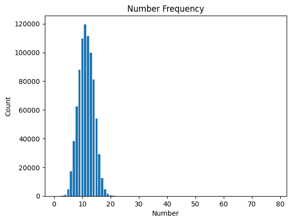
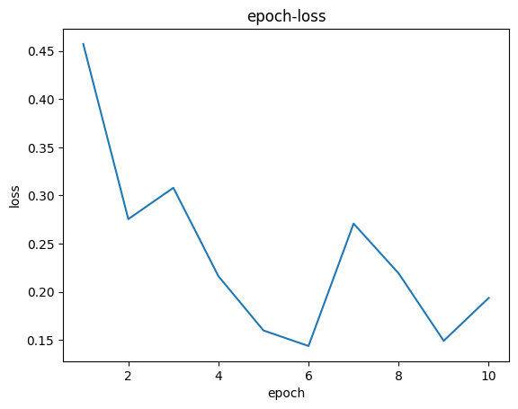
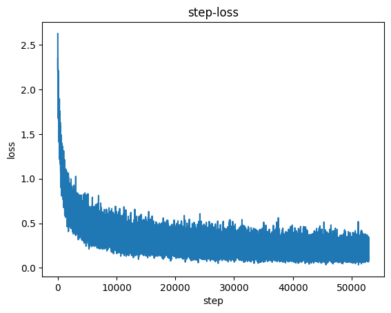
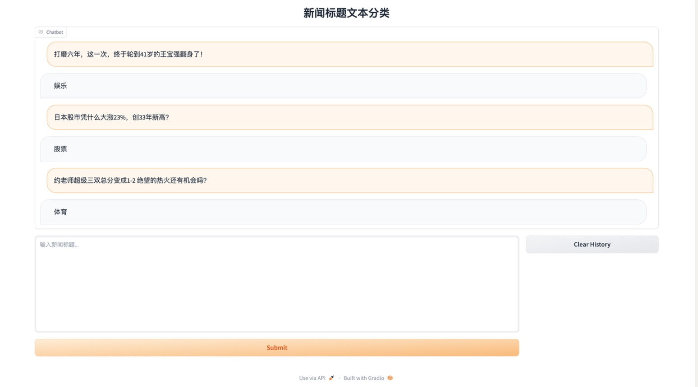

# 选题：中文新闻文本标题分类

组员：陈向钰、罗彬慈

## 流程总览

1. 数据收集
2. 数据处理
3. 超参数选择
4. 模型建立
5. 模型训练
6. 评估模型
7. 推理模块实现

## 数据收集

### 通过网络爬虫，爬取中文新闻网站的新闻标题。
通过`data-spider.py`爬取CCTV新闻网的新闻标题，在Linux服务器上设置corntab定时爬取，最后爬取到的结果存储到`data/`中，爬取日志记录到`spider_log.log`，日志节选如下：

    finished in  Wed Jun  7 13:00:14 2023
        [society] New append : 上海闵行辟谣“被撞车辆为送考车”：4辆涉事车辆均未搭载乘客
        [society] New append : 江西省教育厅介入“高校食堂吃出疑似老鼠头”事件，其他承包商称受到牵连
        [society] New append : 网传“上海闵行区交通事故涉及送考车辆” 当地官方：不存在所谓送考一说
    finished in  Wed Jun  7 14:00:14 2023
        [society] New append : 深圳大学荔枝红了：荔枝树分配至学院采摘共享，餐厅将推荔枝烧烤
        [society] New append : “生母、继父被抓”的临猗十岁男孩被害案进展：检察院已提前介入
        [law] New append : 中共北京市委经济技术开发区工委原副书记、北京经济技术开发区管委会原主任梁胜被开除党籍和公职
        [law] New append : 外卖站长牵线为骑手“代办”健康证实为假证，台州6人获刑
        [law] New append : 违法销售产自日本核辐射区食品，广东一百货公司被罚1万元
        [tech] New append : 研究表明：到2030年代北极夏季可能没有海冰
        [economy_zixun] New append : 财政奖补中小企不“撒胡椒面”
        [edu] New append : 教育部教育考试院发布2023年高考语文试题评析
        [edu] New append : 高考改革正在塑造未来教育
        [edu] New append : 高考改革大事记
        [edu] New append : 揭秘高考试卷的非凡“旅程”
        [edu] New append : 致考生：逢考必过 大胜归来


### 对THUCNews数据集的14个类别的新闻进行处理，提取每个新闻的标题作为数据。

## 数据处理

### 在`preprocess.py`文件中，通过`get_title()`函数，处理THUCNews数据集，将处理完的数据写入`THUCNews-Title`文件夹中。 

    luobinci@Binci-MBA THUCNews-Title % tree
    .
    |____时政.txt
    |____星座.txt
    |____科技.txt
    |____家居.txt
    |____教育.txt
    |____娱乐.txt
    |____股票.txt
    |____社会.txt
    |____体育.txt
    |____彩票.txt
    |____时尚.txt
    |____财经.txt
    |____房产.txt
    |____游戏.txt

### 在`preprocess.py`文件中，通过`read_dataset()`函数，将`THUCNews-Title`中的数据读入到`data.txt`文件中，数据格式为`labeL + \t + content`。

    时政	韩国拟取消向朝鲜运送维护电站用钢铁
    时政	普京提议在莫斯科重建格鲁吉亚苏军纪念碑
    时政	英国野生动物园群狮包围游客汽车(组图)
    时政	洪都拉斯7人死于贩毒团伙火并
    时政	马达加斯加宣布退出南部非洲发展共同体
    时政	印度拟就驻美大使遭美国海关搜身提出抗议

### 通过`preprocess.py`文件中的`dataset_partition()`函数，进行数据集划分，将数据集划分为训练集、测试集合、验证集。
### 建立Vocabulary类，功能是构建词汇表，并提供将文本转换为ID序列的功能。
  - `__init__(self)`: 类的初始化方法，初始化了以下属性：
    - `word_to_id`: 字典，将单词映射为对应的ID。
    - `id_to_word`: 字典，将ID映射为对应的单词。
    - `word_freq`: defaultdict，用于统计每个单词在文本中出现的频率。
    - `num_words`: 整数，记录词汇表中单词的数量。
    - `len_of_text`: 列表，用于记录每个文本的词汇数量。
  - `add_text(self, text)`: 接收一个文本作为参数，并将该文本进行分词处理，然后更新词频统计。将分词后的词汇添加到`word_freq`中，并将文本的词汇数量添加到`len_of_text`列表中。
  - `build_vocab(self)`: 构建词汇表。首先将词频字典按照频率和字母顺序进行排序，然后依次将特殊标记"<PAD>"和"<UNK>"添加到词汇表中，接着将排序后的单词添加到词汇表中。
  - `add_word(self, word)`: 将单词添加到词汇表中。如果单词不存在于`word_to_id`字典中，则为该单词分配一个新的ID，并将单词与ID进行映射，同时更新词汇表中单词的数量。
  - `text_to_ids(self, text)`: 将输入的文本转换为对应的ID序列。首先对文本进行分词处理，然后遍历分词后的词汇列表，如果单词存在于`word_to_id`字典中，则将其对应的ID添加到`ids`列表中，否则将"<UNK>"的ID添加到`ids`列表中，最后返回`ids`。
  - `save_vocabulary(self)`: 将词汇表保存到文件中。将`word_to_id`、`id_to_word`、`word_freq`、`num_words`和`len_of_text`分别保存为pickle文件。
  - `load_vocabulary(self)`: 从文件中加载词汇表。将pickle文件中的内容读取并加载到对应的属性中。
- 通过`preprocess.py`中的`label_to_id()`函数将label转化为ID。

## 超参数选择

max_length：新闻标题转化为ID序列的最大长度，根据所有数据的分析得出20能覆盖绝大多数数据。



embedding_dim：词向量嵌入维度64维

hidden_dim：LSTM（长短时记忆网络）隐藏层的维度，设为128

output_dim：模型输出维度，原始训练数据有14个类别，设置为14

n_layers：LSTM层的层数，设为2

dropout：dropout层的丢弃率，设为0.5

BATCH_SIZE：批次大小设为128

LR：学习率设为0.001

EPOCHS：训练轮数设为10

## 模型建立


定义了一个名为RNN的PyTorch模型类，继承自`nn.Module`。该类使用Embedding层、LSTM层和线性层构建了一个基本的循环神经网络模型。

下面是对该类中的方法和层的功能进行分析：

1. `__init__(self, vocab_size, embedding_dim, hidden_dim, output_dim, n_layers, dropout)`: 类的初始化方法，接收模型构建所需的参数。初始化了以下属性：
   - `embedding`: Embedding层，用于将输入的单词ID序列转换为嵌入表示。`vocab_size`表示词汇表的大小，`embedding_dim`表示嵌入层的维度。
   - `rnn`: LSTM层，用于对输入序列进行建模和提取特征。`embedding_dim`表示输入的特征维度，`hidden_dim`表示LSTM隐藏层的维度，`n_layers`表示LSTM层的层数，`dropout`表示LSTM层的丢弃率。
   - `fc`: 线性层，用于将LSTM的输出映射到指定的输出维度。`hidden_dim`表示输入特征的维度，`output_dim`表示输出的维度。
   - `dropout`: Dropout层，用于减少过拟合。`dropout`表示丢弃率。
2. `forward(self, text)`: 定义了前向传播的计算过程。接收一个文本的单词ID序列作为输入，返回模型的输出。具体的计算过程如下：
   - 将输入的单词ID序列通过Embedding层进行嵌入表示，并应用Dropout层进行随机丢弃一部分嵌入向量。
   - 将嵌入后的序列输入LSTM层，获取输出、最后一个时间步的隐藏状态和细胞状态。
   - 将最后一个时间步的隐藏状态通过线性层进行映射，并应用Dropout层进行随机丢弃一部分输出特征。
   - 返回线性层的输出作为模型的预测结果。

该RNN模型用于处理文本数据，通过嵌入层将输入的单词ID序列转换为稠密的向量表示，然后使用LSTM层对序列进行建模，最后通过线性层将LSTM的输出映射到指定的输出维度。在计算过程中引入了Dropout层来减少过拟合。

## 模型训练

1. 创建了一个空字典`training_log`，用于记录训练日志。
2. 创建了两个空列表`epoch_loss`和`step_loss`，分别用于记录每个epoch的总体损失和每个step的损失。
3. 进行多个epoch的训练循环。
4. 在每个epoch开始时，将模型设置为训练模式，初始化`running_loss`为0。
5. 遍历训练数据集中的每个batch，依次进行以下操作：
   - 将输入数据和标签数据移动到设备上（如GPU）。
   - 通过模型前向传播计算得到输出。
   - 计算输出和标签之间的损失。
   - 将优化器的梯度置零。
   - 反向传播计算梯度。
   - 使用优化器更新模型的参数。
   - 累计当前batch的损失值到`running_loss`中。
   - 打印当前epoch、step和损失值。
   - 将当前step的损失值添加到`step_loss`列表中。
6. 将当前epoch的损失值添加到`epoch_loss`列表中。
7. 构建当前epoch的模型保存路径，并使用`torch.save()`保存模型。
8. 将训练日志记录到`training_log`字典中。
9. 使用`json.dump()`将`training_log`字典保存到名为`training_log.json`的文件中。

训练结果

```
epoch1 step5291/5291 loss:0.7561 
epoch2 step5291/5291 loss:0.4092 
epoch3 step5291/5291 loss:0.5228 
epoch4 step5291/5291 loss:0.3519 
epoch5 step5291/5291 loss:0.4034 
epoch6 step5291/5291 loss:0.4642 
epoch7 step5291/5291 loss:0.4276 
epoch8 step5291/5291 loss:0.2244 
epoch9 step5291/5291 loss:0.3594 
epoch10 step5291/5291 loss:0.3031 
```

## 模型评估





可见，总体上来看，模型在训练过程中的loss不断降低，我们采取第六次训练的模型作为最终结果。

对模型进行测试，得到Accuracy: 93.13%。

## 推理模块

使用Gradio构建的交互式应用程序，用于使用已训练好的模型进行文本分类预测。

主要部分解析：

1. 导入所需的模块和函数，包括PyTorch、预处理函数和Gradio。
2. 定义了设备类型，根据CUDA的可用性选择使用GPU或CPU。
3. 加载预训练的模型，并将其设置为评估模式。
4. 定义了将文本转换为ID的函数`text_to_id`，该函数使用预处理中的`Vocabulary`类将输入文本转换为ID序列，并对序列进行填充或截断以适应模型输入的固定长度。
5. 定义了`predict`函数，用于根据输入文本进行预测。该函数将文本转换为模型所需的输入格式，然后使用模型进行推理，并返回预测的标签。在推理过程中，将推理结果添加到聊天记录中，并将其返回。
6. 定义了`postprocess`函数，用于将预测结果进行后处理，将Markdown格式的文本转换为HTML格式。
7. 将`postprocess`函数应用到`gr.Chatbot`的`postprocess`属性中，以对预测结果进行后处理。
8. 定义了两个重置函数`reset_user_input`和`reset_state`，用于清空用户输入和聊天记录。
9. 使用Gradio的`Blocks`创建一个交互式应用程序。
10. 定义了应用程序的界面布局，包括一个聊天窗口和输入框。
11. 定义了两个按钮，一个用于提交用户输入进行预测，另一个用于清空聊天记录。
12. 定义了两个状态`history`和`chatbot`，用于保存聊天记录和预测结果。
13. 将预测函数、重置函数和状态与按钮的点击事件进行绑定。
14. 使用`demo.queue().launch()`启动Gradio应用程序，显示交互界面。

该应用程序可以在Web浏览器中显示一个聊天界面，用户可以输入新闻标题并提交进行预测。预测结果将显示在聊天窗口中，并且用户可以清空聊天记录。

效果图（从互联网上随机搜索新闻标题测试）


